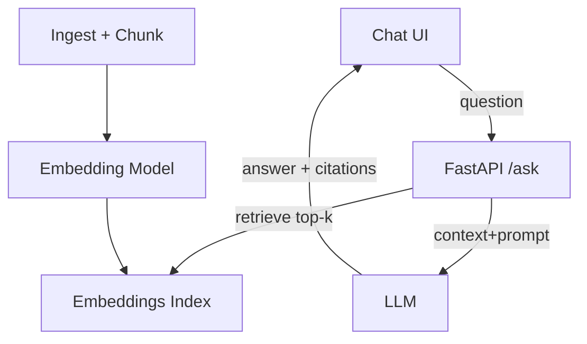

# Architecture (Reference)

## High-level
- UI: chat interface with citations
- API: `/ask` orchestrates retrieval + generation
- Retrieval: embeddings index over course materials
- LLM: instruction-tuned with syllabus-aware prompt policy
- Guardrails: refuse out-of-scope topics; prefer citations

