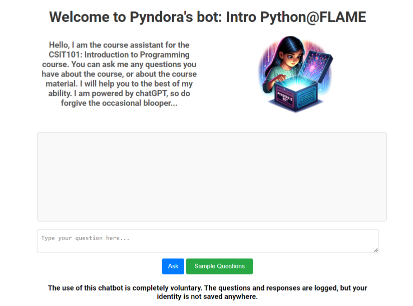

# AI Programming Tutor (RAG + Course Assistant)

Conversational assistant for an Intro to Programming course. It answered logistics questions, explained Python concepts, and generated practice problems with **citations to source notes**.

**Paper:** [`docs/Dissertation_Final.pdf`](docs/Dissertation_Final.pdf)

## Demo

## What this repo contains
- Demo images, the full dissertation, and reference docs describing how the system worked.
- Status: original 2023–24 code isn’t public; this repo focuses on outcomes, design, and demo materials.

## Learn more
- Architecture: [`ARCHITECTURE.md`](ARCHITECTURE.md)
- API design: [`API.md`](API.md)
- Current status: [`STATUS.md`](STATUS.md)

